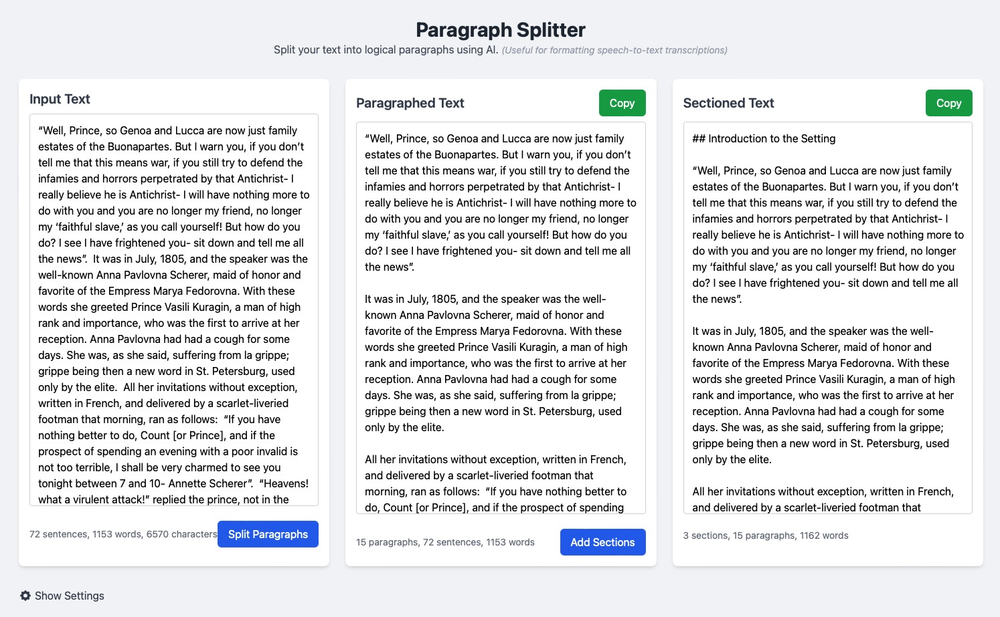

# Paragraph Splitter

A web-based tool that uses AI to split unformatted text into logical paragraphs and sections. This is particularly useful for formatting speech-to-text transcriptions or any large blocks of text that lack proper paragraph breaks.

## How It Works

1. Paste your unformatted text into the input area
2. Click "Split Paragraphs" to process the text
3. Review the paragraphed text in the middle column
4. Optionally, click "Add Sections" to organize the text with headings
5. Copy the processed text with the "Copy" button

## Requirements

- Modern web browser with JavaScript enabled
- OpenAI API key (for AI processing)

## Setup

1. Open the `paragraph-splitter.html` file in a web browser
2. Click the settings icon at the bottom of the page
3. Enter your OpenAI API key and adjust other settings as needed
4. Save settings

## Features

- **Paragraph Splitting**: Automatically divides text into logical paragraphs based on content and context
- **Section Organization**: Adds section headings to further organize paragraphed text
- **Batch Processing**: Handles large texts by processing them in batches
- **Progress Tracking**: Shows real-time progress during processing
- **Copy to Clipboard**: One-click copying of processed text
- **Responsive Design**: Works on desktop and mobile devices
- **Local Storage**: Saves your input text and settings between sessions

## Technical Details

The Paragraph Splitter uses:
- Vue.js for the user interface
- Tailwind CSS for styling
- OpenAI's API for text analysis
- Browser localStorage for saving settings and input

## Author

Developed by Michael Engelbrecht

## License

This project is licensed under the MIT License - see the [LICENSE](LICENSE) file for details.
